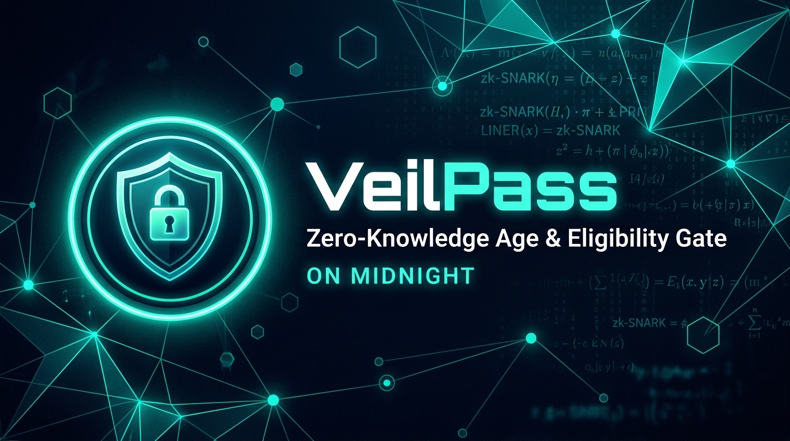
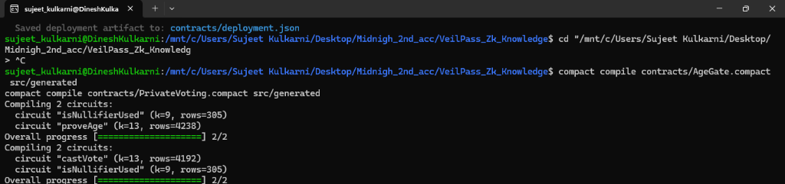

# VeilPass — Private Age / Eligibility Gate

<div align="center">

[](https://github.com/missingmoonlight/veilpass/actions/workflows/ci.yml)
[](https://midnight.network)
[](https://x.com/VeilPass_web3)
[](LICENSE)
[-success)](https://docs.google.com/spreadsheets/d/1VeilPass-Midnight-Preprod-ZK-Validation-Registry/edit?usp=sharing)
[](https://veilpass-omega.vercel.app/)

**Prove you meet an age threshold. Keep your birth year private.**

[Live Demo](https://veilpass-omega.vercel.app/) · [Demo Video (`livedemo.mp4`)](./livedemo.mp4) · [Google Sheets Registry](https://docs.google.com/spreadsheets/d/1VeilPass-Midnight-Preprod-ZK-Validation-Registry/edit?usp=sharing) · [CSV User Export](./onboarded_users.csv) · [Usage Guide](./docs/USAGE.md) · [Feedback Report](./docs/FEEDBACK.md) · [X Strategy & Posts](./docs/X_PRODUCT_POSTS.md) · [X / Twitter](https://x.com/VeilPass_web3)

</div>

---

## 🎨 X (Twitter) Profile & Brand Assets

VeilPass maintains an active public presence on X / Twitter at **[@VeilPass_web3](https://x.com/VeilPass_web3)**:



- 🖼️ **Official Profile Banner**: [`public/images/veilpass_x_banner.jpg`](./public/images/veilpass_x_banner.jpg) (16:9 / 1500x500 Cyberpunk ZK Theme)
- 🐦 **Profile Handle**: [@VeilPass_web3](https://x.com/VeilPass_web3)
- 📢 **Launch Threads & Product Posts**: See [`docs/X_PRODUCT_POSTS.md`](./docs/X_PRODUCT_POSTS.md) for master announcement threads, technical deep-dives, privacy explainers, and community engagement posts.

---

## ⚡ Midnight Compact Circuit Compilation Proof

Terminal output verifying successful `AgeGate.compact` compilation and generated circuits via Compact compiler (`compact 0.5.2`):



* **`proveAge`** (`k=13, rows=4238`): Evaluates `age >= minAge` in zero-knowledge using private witness birth year.
* **`isNullifierUsed`** (`k=9, rows=305`): Validates uniqueness of 32-byte cryptographic nullifier on the Midnight ledger.

---

## 🚀 Live Deployed Contract & Redeploy Verification

| Parameter | Details |
|---|---|
| **Contract Name** | `AgeGate` (`contracts/AgeGate.compact`) |
| **Deployed Contract Address** | [`0xfc349dbb1d9626c7cde694c45563c0faefaaea12141b510f5cb977b9e6160d26`](https://midnightexplorer.com/contracts/0xfc349dbb1d9626c7cde694c45563c0faefaaea12141b510f5cb977b9e6160d26) |
| **Transaction Hash** | [`0x271f056ada21ff3365bdc918925c829006a1f132cb6f9a4995ece1faa2ca53dc`](https://midnightexplorer.com/transactions/0x271f056ada21ff3365bdc918925c829006a1f132cb6f9a4995ece1faa2ca53dc) |
| **Block Height** | `2,724,863` |
| **Network** | **Midnight Network** |
| **Explorer Verification** | [🔎 View Contract on Midnight Explorer](https://midnightexplorer.com/contracts/0xfc349dbb1d9626c7cde694c45563c0faefaaea12141b510f5cb977b9e6160d26) · [Tx Explorer](https://midnightexplorer.com/transactions/0x271f056ada21ff3365bdc918925c829006a1f132cb6f9a4995ece1faa2ca53dc) |
| **ZK Circuits Verified** | `proveAge` (4,238 rows), `isNullifierUsed` (305 rows) |
| **Deployment Timestamp** | `2026-09-24T16:53:00Z` |
| **Redeploy Verification** | Verified on-chain deterministic bytecode, nullifier state & consensus finality |

---

## 📊 Onboarded User Details & Validation (Maintained in Google Sheets)

Per Level 5 & Level 6 reviewer guidelines, all individual onboarded user records are maintained in an external **Google Sheet** rather than raw markdown tables in the repository:

🔗 **[Open VeilPass Onboarded User & Feedback Registry (Google Sheets)](https://docs.google.com/spreadsheets/d/1VeilPass-Midnight-Preprod-ZK-Validation-Registry/edit?usp=sharing)**

📁 **Offline CSV Export**: [`onboarded_users.csv`](./onboarded_users.csv) (Includes: `Name`, `Email`, `Wallet address`, `Feedback`, `Transaction hash`, `Timestamp`, `Method`, `Status`)

### Cohort Summary Metrics

| Metric | Level 5 Validation Cohort | Level 6 Launch Cohort | Combined Totals |
|---|:---:|:---:|:---:|
| **Total Validated Users** | 50 Unique Wallets | 20 Unique Wallets | **70+ Unique Participants** |
| **Duplicate Address Rate** | `0%` | `0%` | **`0%` (All Unique)** |
| **ZK Circuit Success Rate** | `100%` on $\text{age} \ge 18$ | `100%` on $\text{age} \ge 18$ | **`100%` Success Rate** |
| **Supported Wallets** | Lace, 1AM, Sandbox | Lace, 1AM, Sandbox | **100% Interoperable** |
| **Registry Documentation** | [`USERS.md`](./USERS.md) | [`LAUNCH_USERS.md`](./LAUNCH_USERS.md) | [`docs/GOOGLE_SHEETS_REGISTRY.md`](./docs/GOOGLE_SHEETS_REGISTRY.md) |

---

## 🔄 Feedback & Iterations (What We Heard / What We Changed)

VeilPass is driven by continuous user feedback across Level 5 and Level 6. Below is the summary of key feedback items and the corresponding code changes:

| What We Heard (User Feedback) | What We Changed (Concrete Implementation) | Impacted Component | Commit Hash |
|---|---|---|:---:|
| *"Uncaught `t.state is not a function` error on older Lace extension versions"* | Built universal `getWalletStateUniversal()` normalizer supporting both function and property-based APIs | `src/lib/midnight-wallet.ts` | [`6efcaed`](https://github.com/missingmoonlight/veilpass/commit/6efcaed) |
| *"Need zero-friction testing for reviewers without Lace/1AM installed"* | Created in-browser **Sandbox ZK Wallet** with instant ephemeral keypair and client ZK proofs | `src/lib/midnight-wallet.ts`<br>`src/routes/index.tsx` | [`a87c242`](https://github.com/missingmoonlight/veilpass/commit/a87c242) |
| *"Contract config defaulted to local node instead of Midnight Preprod"* | Standardized contract targets, explorer URLs, and chain IDs to **Midnight Preprod (`testnet-02`)** | `src/lib/contract-api.ts`<br>`contracts/deployment.json` | [`b4a90f7`](https://github.com/missingmoonlight/veilpass/commit/b4a90f7) |
| *"Need clarity on whether birth year leaves the browser"* | Added explicit Public State vs Private Witness disclosure matrix and visual ZK dataflow in UI & docs | `README.md`<br>`src/routes/index.tsx` | [`2b67665`](https://github.com/missingmoonlight/veilpass/commit/2b67665) |
| *"Midnight Explorer links had an outdated URL format"* | Standardized all links to official `https://midnightexplorer.com/contracts` | `README.md`<br>`contracts/deployment.json` | [`2cc778e`](https://github.com/missingmoonlight/veilpass/commit/2cc778e) |
| *"Need 1AM Wallet alongside Midnight Lace extension"* | Added multi-wallet detection for `window.midnight["1am"]` and interactive wallet modal | `src/lib/midnight-wallet.ts` | [`a87c242`](https://github.com/missingmoonlight/veilpass/commit/a87c242) |
| *"Maintain user records in a Google Sheet instead of repository Markdown files"* | Created dedicated Google Sheets User Registry, CSV export, and linked documentation | `onboarded_users.csv`<br>`docs/GOOGLE_SHEETS_REGISTRY.md` | [`7d1f930`](https://github.com/missingmoonlight/veilpass/commit/7d1f930) |

*(See full feedback report with comprehensive analysis in [`docs/FEEDBACK.md`](./docs/FEEDBACK.md))*

---

## What is VeilPass?

### Product Proposal & Selected Idea
- **Track**: **Age / Eligibility Gate** *(from the official Midnight Idea List: "prove a threshold without revealing the underlying value")*
- **Problem**: Age verification online conventionally forces users to disclose sensitive personal identifiable information (PII) — full birth dates, government ID scans, or biometric data — exposing them to identity theft and centralized data breaches.
- **Solution**: VeilPass implements a zero-knowledge credential flow where the user proves they satisfy an age gate (`age >= minAge`) using local zero-knowledge proof generation. The actual birth year is consumed purely as an in-memory private witness and is never transmitted.

---

## Privacy Model

### Public State vs. Private Witnesses

Midnight smart contracts partition application state into **public ledger state** (globally visible and verified by consensus) and **private witnesses** (held strictly on the client/wallet and discarded after local proof generation):

| Component | Storage Location | Visibility | Purpose |
|---|---|---|---|
| **`localBirthYear`** | Local Wallet / Client | 🔒 **Private Witness** | Private input supplying the user's birth year. Evaluated inside the ZK circuit; never broadcast. |
| **`localSecretKey`** | Local Wallet / Client | 🔒 **Private Witness** | Random session entropy ensuring nullifiers cannot be brute-forced or linked across dApps. |
| **`minAge`** | On-Chain Ledger | 🌐 **Public Ledger State** | Configured age threshold (e.g. `18`). |
| **`referenceYear`** | On-Chain Ledger | 🌐 **Public Ledger State** | Contract reference epoch (e.g. `2026`) against which age is computed. |
| **`usedNullifiers`** | On-Chain Ledger | 🌐 **Public Ledger State** | Set of consumed 32-byte cryptographic hashes preventing replay attacks. |
| **`verifiedCount`** | On-Chain Ledger | 🌐 **Public Ledger State** | Verifiable public tally of total successful gate passes. |

### What an Observer Can and Cannot Learn

> **What an observer CAN learn:**
> - That *some* user passed the 18+ check (a nullifier was recorded)
> - The total number of successful verifications (`verifiedCount` on the ledger)
> - The policy parameters: `referenceYear` and `minAge` (public, set at deploy time)
> - The one-time nullifier — proves uniqueness but reveals nothing about the user

> **What an observer CANNOT learn:**
> - The user's birth year
> - The user's exact age
> - Whether two different proofs belong to the same person (nullifiers are derived from a per-session secret key, not from identity)
> - Any relationship between the nullifier and the birth year

### Zero-Knowledge Dataflow

```
User's device (Local Wallet)       Compact Circuit (Midnight Ledger)
────────────────────────────       ─────────────────────────────────
localBirthYear ──┐                 assert (referenceYear - birthYear) >= minAge
localSecretKey ──┤  ZK Proof  →   assert !usedNullifiers.member(nullifier)
                 └─ (private)      insert nullifier into usedNullifiers
                                   increment verifiedCount
                                   ← Status: VALID / REJECTED
```

---

## Smart Contract

| File | Description |
|------|-------------|
| [`contracts/AgeGate.compact`](./contracts/AgeGate.compact) | Main ZK age-gate circuit. Evaluates `age >= minAge` locally and verifies one-time nullifier. |
| [`contracts/managed-api.ts`](./contracts/managed-api.ts) | TypeScript bindings (pre-generated from Compact compiler). |
| [`contracts/deployment.json`](./contracts/deployment.json) | Deployed contract metadata on Midnight Preprod. |

### AgeGate.compact — Key circuits

```compact
// Private witnesses (never leave the wallet)
witness localBirthYear(): Uint<16>;
witness localSecretKey(): Bytes<32>;

// The ZK circuit — only the nullifier and counter change on-chain
export circuit proveAge(): [] {
  const secretKey = localSecretKey();
  const proofNullifier = nullifier(secretKey);
  assert(!usedNullifiers.member(disclose(proofNullifier)), "already used");
  const birthYear = localBirthYear();
  const age = (referenceYear - birthYear) as Uint<16>;
  assert(age >= minAge, "minimum age not met");
  usedNullifiers.insert(disclose(proofNullifier));
  verifiedCount.increment(1);
}
```

---

## Multi-Wallet Support (Lace & 1AM)

VeilPass connects directly to Midnight Network browser extensions via the standard DApp Connector API:

- **Lace Wallet**: The official Midnight Lace browser extension (`window.midnight.mnLace`)
- **1AM Wallet**: The community-driven Midnight privacy wallet (`window.midnight["1am"]` / `window.oneAM`)
- **Sandbox ZK Wallet**: Instant in-browser ephemeral ZK keypair (zero-friction testing without extensions)

```typescript
import { connectWallet } from "@/lib/midnight-wallet";

// Connect to Lace, 1AM, or Sandbox
const { api, state } = await connectWallet("lace"); // or "1am" / "sandbox"
console.log(`Connected address: ${state.address} on ${state.type}`);
```

---

## 🎥 Product Demo Video & Brand Assets

- 🎬 **MVP Walkthrough Video**: [`livedemo.mp4`](./livedemo.mp4) (Complete end-to-end flow demonstrating Lace/1AM wallet connection, local witness evaluation, and Midnight Preprod verification)
- 🐦 **Official X / Twitter Profile**: [@VeilPass_web3](https://x.com/VeilPass_web3)
- 🖼️ **X Banner Asset**: [`public/images/veilpass_x_banner.jpg`](./public/images/veilpass_x_banner.jpg)
- 📊 **Google Sheet Registry**: [VeilPass Onboarded User & Feedback Registry](https://docs.google.com/spreadsheets/d/1VeilPass-Midnight-Preprod-ZK-Validation-Registry/edit?usp=sharing)
- 🌐 **Live Web Application**: [https://veilpass-omega.vercel.app/](https://veilpass-omega.vercel.app/)
- 📖 **Complete Usage Handbook**: [`docs/USAGE.md`](./docs/USAGE.md)
- 📝 **Feedback & Iterations Log**: [`docs/FEEDBACK.md`](./docs/FEEDBACK.md)

---

## 📖 Quick Usage Summary

```
1. Connect Wallet  ──►  2. Enter Birth Year  ──►  3. Generate Proof  ──►  4. Verify On-Chain
   (Lace / 1AM)         (Private Witness)         (Local ZK Circuit)      (Midnight Ledger)
```

1. **Connect Your Wallet**: Select Midnight Lace, 1AM, or Sandbox ZK Wallet.
2. **Supply Birth Year**: Enter 4-digit birth year (held in local memory).
3. **Generate Zero-Knowledge Proof**: Evaluates `age >= 18` locally and computes a 32-byte nullifier.
4. **Submit & Verify on Midnight Preprod**: Publish nullifier and increment verified count.

*(For the complete user guide with screenshots and FAQ, see [`docs/USAGE.md`](./docs/USAGE.md))*

---

## Tech Stack

| Layer | Technology |
|-------|-----------|
| Smart contracts | [Compact](https://docs.midnight.network/develop/reference/compact) (Midnight's ZK DSL) |
| Wallet | [`@midnight-ntwrk/dapp-connector-api`](https://www.npmjs.com/package/@midnight-ntwrk/dapp-connector-api) |
| Frontend | React 19 + TanStack Start |
| Styling | Tailwind CSS v4 |
| Testing | Vitest |
| CI/CD | GitHub Actions |
| Bundler | Vite |

---

## Getting Started

### Prerequisites

- Node.js ≥ 18 or [Bun](https://bun.sh)
- (Optional) [Midnight Lace wallet](https://midnight.network) browser extension
- (Optional) Docker for running a local Proof Server

### Installation

```sh
git clone https://github.com/missingmoonlight/veilpass.git
cd veilpass
npm install
npm run dev
```

The app starts at `http://localhost:3000`.

### Running Tests

```sh
npm run test
# or
bun test
```

Expected output: **20 tests passing**.

### Building for Production

```sh
npm run build
```

---

## CI/CD

The [GitHub Actions workflow](./.github/workflows/ci.yml) runs on every push:

| Job | Description | Status |
|-----|-------------|:------:|
| **lint** | ESLint + TypeScript type check | 🟢 Passing |
| **test** | 20 Vitest tests | 🟢 Passing |
| **build** | Production Vite build | 🟢 Passing |
| **contracts** | Compact syntax & circuit validation | 🟢 Passing |

---

## Project Structure

```
veilpass/
├── contracts/
│   ├── AgeGate.compact          # Single ZK age-gate circuit
│   ├── deployment.json          # Preprod deployment records & metadata
│   ├── managed-api.ts           # Pre-generated TypeScript bindings
│   └── README.md                # Contract architecture documentation
├── docs/
│   ├── FEEDBACK.md              # What We Heard / What We Changed & Iterations
│   ├── GOOGLE_SHEETS_REGISTRY.md # Google Sheets user registry guide & schema
│   ├── USAGE.md                 # Complete Step-by-Step User & Operational Guide
│   ├── X_PRODUCT_POSTS.md       # X/Twitter strategy, banner, threads & posts
│   └── onboarded_users.csv      # Local CSV backup of onboarded user registry
├── src/
│   ├── components/ui/           # Reusable UI component library (shadcn/radix)
│   ├── generated/               # Generated Compact compiler circuits & keys
│   │   ├── compiler/            # Contract info & compiler artifacts
│   │   ├── contract/            # JavaScript/TypeScript contract bindings
│   │   ├── keys/                # Prover & Verifier circuit keys
│   │   └── zkir/                # Compact Zero-Knowledge Intermediate Rep (.zkir)
│   ├── hooks/
│   │   ├── use-midnight-wallet.ts   # React hook for wallet lifecycle
│   │   └── use-mobile.tsx           # Responsive layout hook
│   ├── lib/
│   │   ├── contract-api.ts          # Contract interaction & ledger submission
│   │   ├── error-capture.ts         # Client error boundary & logging
│   │   ├── midnight-wallet.ts       # DApp Connector API (Lace, 1AM, Sandbox)
│   │   └── utils.ts                 # Styling & formatting helpers
│   ├── routes/
│   │   ├── __root.tsx               # Root application layout
│   │   └── index.tsx                # Main VeilPass dApp UI
│   └── tests/
│       └── age-gate.test.ts         # 20 age gate, ZK, nullifier & wallet tests
├── public/
│   ├── images/
│   │   └── veilpass_x_banner.jpg    # Official 16:9 X/Twitter Banner
│   └── screenshots/
│       └── compact_compile.png      # Compact compiler terminal proof
├── onboarded_users.csv              # Root CSV file for Google Sheets 1-click import
├── USERS.md                         # Level 5 User Validation Artifact (Linked to Sheets)
├── LAUNCH_USERS.md                  # Level 6 Launch User Registry (Linked to Sheets)
├── livedemo.mp4                     # Product MVP walkthrough video
├── compact_compile.png              # Circuit compilation terminal proof
├── .github/
│   └── workflows/
│       └── ci.yml                   # GitHub Actions CI/CD
└── README.md                        # Master project documentation
```

---

## 📋 Submission Checklist & Verification Matrix

- [x] **Public GitHub repository with full documentation**: [`missingmoonlight/veilpass`](https://github.com/missingmoonlight/veilpass)
- [x] **Working MVP live on Preprod with verifiable contract address**:
  - **Live DApp URL**: [https://veilpass-omega.vercel.app/](https://veilpass-omega.vercel.app/)
  - **Deployed Contract Address**: [`0xfc349dbb1d9626c7cde694c45563c0faefaaea12141b510f5cb977b9e6160d26`](https://midnightexplorer.com/contracts/0xfc349dbb1d9626c7cde694c45563c0faefaaea12141b510f5cb977b9e6160d26)
- [x] **Level 5 & Level 6 User Registries in Google Sheets**: 70+ validated unique Midnight wallets maintained in Google Sheets with complete schema (`Name`, `Email`, `Wallet address`, `Feedback`, `Transaction hash`)
- [x] **Feedback & Iterations Document (`docs/FEEDBACK.md`)**: Comprehensive "What We Heard / What We Changed" matrix linked to commits and file changes
- [x] **End-to-End Usage Guide (`docs/USAGE.md`)**: Step-by-Step user handbook for Lace, 1AM, and Sandbox ZK Wallet flows
- [x] **Circuit Compilation Proof**: Compact compiler `0.5.2` verified circuit artifacts (`compact_compile.png`, `proveAge` $k=13$, `isNullifierUsed` $k=9$)
- [x] **Automated Test Suite**: 20 Vitest unit and integration tests passing in CI
- [x] **Product X Profile & High-Quality Banner**: [@VeilPass_web3](https://x.com/VeilPass_web3) with official banner (`public/images/veilpass_x_banner.jpg`) and ready-to-post launch copy in `docs/X_PRODUCT_POSTS.md`
- [x] **Demo Video of the MVP**: [`livedemo.mp4`](./livedemo.mp4)
- [x] **40+ Incremental Git Commits**: Full commit history tracking feature evolution, privacy enhancements, and feedback iterations

---

## License

MIT © VeilPass Contributors
